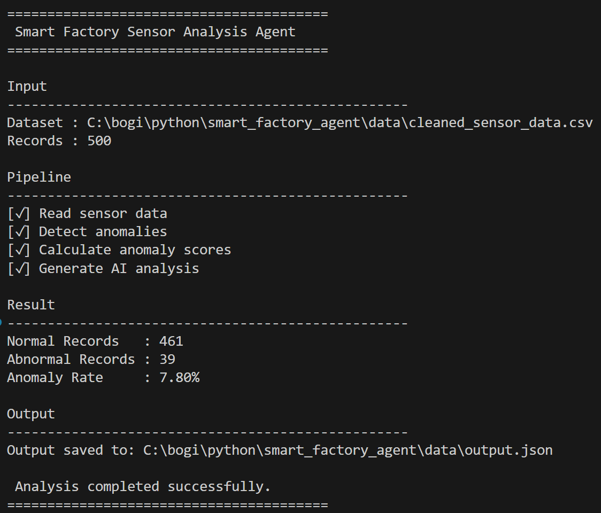
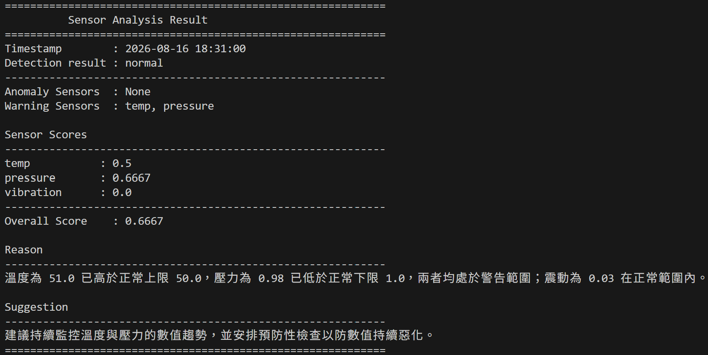
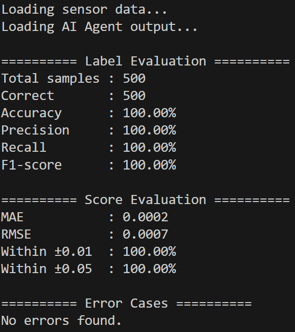

# Smart Factory Agent

## 1. Overview

Smart Factory Agent is an AI-powered sensor monitoring system for a smart factory scenario.

The system processes sensor data, validates the input, and uses an AI Agent powered by Gemini to analyze sensor conditions. The Agent performs anomaly detection, calculates a score, and generates reasons and suggestions based on the analysis results.

## 2. Installation

- Python 3.14.7
- Gemini API Key

### Setup

Clone the repository:

```bash
git clone <repository-url>
cd smart_factory_agent
```
Create and activate a virtual environment:
```bash
python -m venv .venv
.venv\Scripts\activate
```
Install the required dependencies:
```bash
pip install -r requirements.txt
```

### Environment Configuration

Create a `.env` file in the project root and set your Gemini API key before running the Agent:
```env
GEMINI_API_KEY=your_api_key_here
```
## 3. Usage

### Generate Sensor Data
Generate sensor data for testing:
```bash
python src/generate_data.py --rows 500 --interval 1
```
This generates 500 sensor data records with timestamps at 1-minute intervals.
The data generator supports the following options:
| Argument     | Description                                 | Default           |
| ------------ | ------------------------------------------- | ----------------- |
| `--rows`     | Number of rows to generate (100-500).       | Required          |
| `--interval` | Timestamp interval in minutes (`1` or `5`). | `1`               |

The generated sensor data is saved as:
```text
data/sensor_data.csv
```
### Validate Sensor Data
Validate the generated sensor data:
```bash
python src/validation_data.py
```
The validation process checks the sensor data for invalid or missing values and generates a JSON file containing detected errors:
```text
data/Validation_errors.json
```
If validation errors are found, correct the corresponding data according to the information provided in Validation_errors.json.
### Clean Sensor Data
After correcting the detected errors, run:
```bash
python src/clean_data.py
```
This step cleans and prepares the corrected sensor data for the main pipeline.
### Run the AI Agent
```bash
python src/main.py
```
The main pipeline performs data processing and uses the Gemini-powered AI Agent to analyze the sensor data.

A successful execution displays the analysis results in the terminal.

For example:



The generated analysis results are stored in:
```text
data/output.json
```
### Query Results 
The validation results can also be checked using:
```bash
python test/validation_result.py
```
The generated results can be queried by timestamp:
```bash
python test/query_result.py --time "2026-08-16 18:31:00"
```
For example:



## 4. System Workflow
The overall workflow is:
```text
Generate Sensor Data
        ↓
Data Validation
        ↓
   AI Agent (Gemini)
        │
        ├── Anomaly Detection
        ├── Score Calculation
        └── Generate Reasons & Suggestions
        ↓
    Result JSON
        ↓
   Output Result
```
The AI Agent is responsible for the main analysis tasks:
- **Anomaly Detection**  
  Determines whether the sensor readings are normal or abnormal, and identifies sensors that are in a warning state.
- **Score Calculation**  
  Calculates a score based on the sensor conditions.
- **Generate Reasons & Suggestions**  
  Generates a natural-language explanation of the detected conditions and provides suggestions for further action.

The analysis results are stored as structured JSON for subsequent querying and evaluation.

## 5. Evaluation
The system was evaluated using a validation dataset containing 500 samples.

### Label & Score Evaluation
The classification results were evaluated using:

- Accuracy
- Precision
- Recall
- F1-score

The generated scores were evaluated using:
- MAE
- RMSE
- Percentage of predictions within ±0.01
- Percentage of predictions within ±0.05



These results show that the Agent produces consistent anomaly labels and closely matches the expected scores on the dataset.